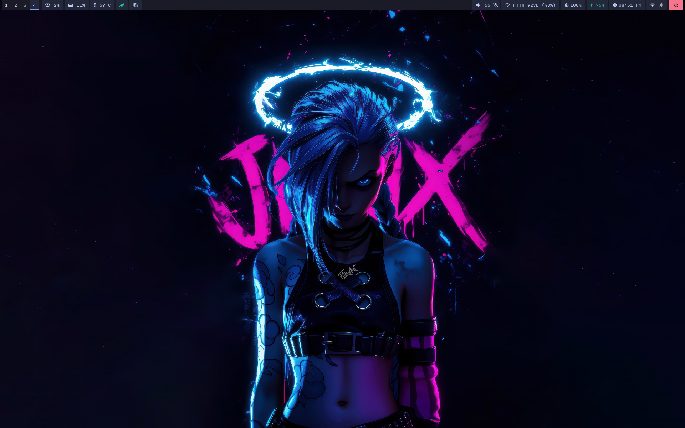
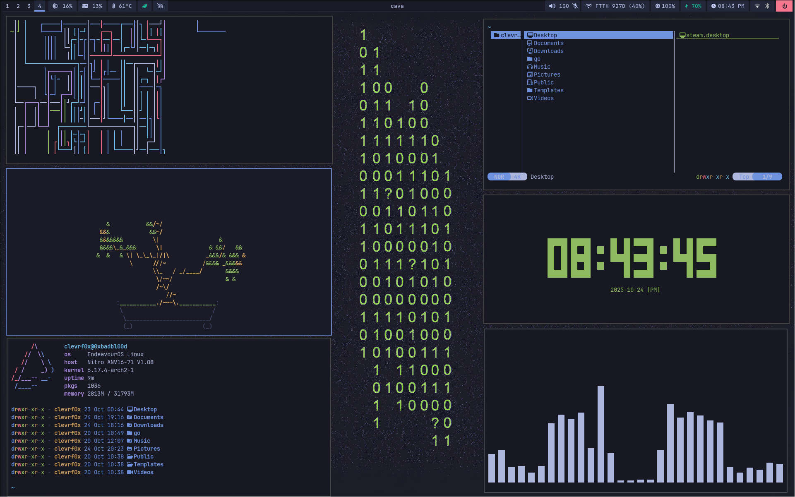
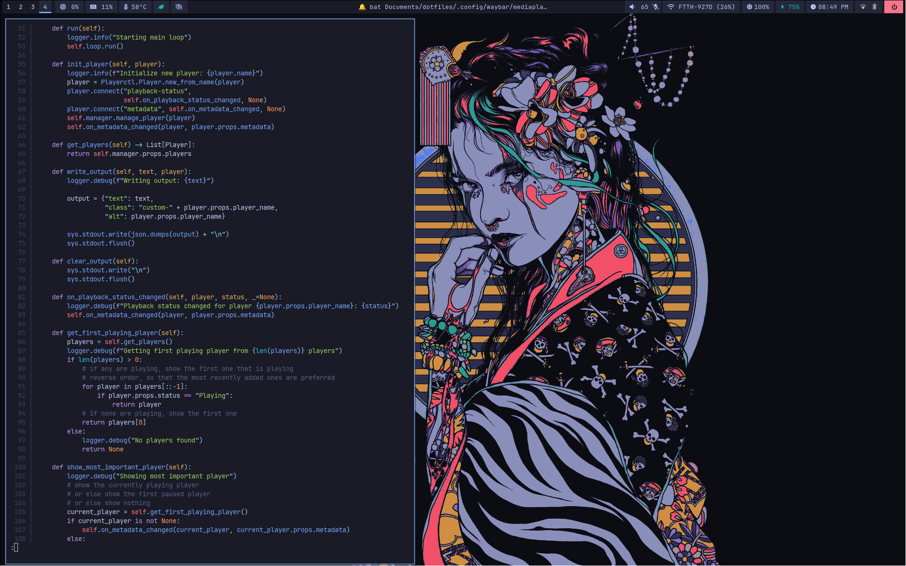
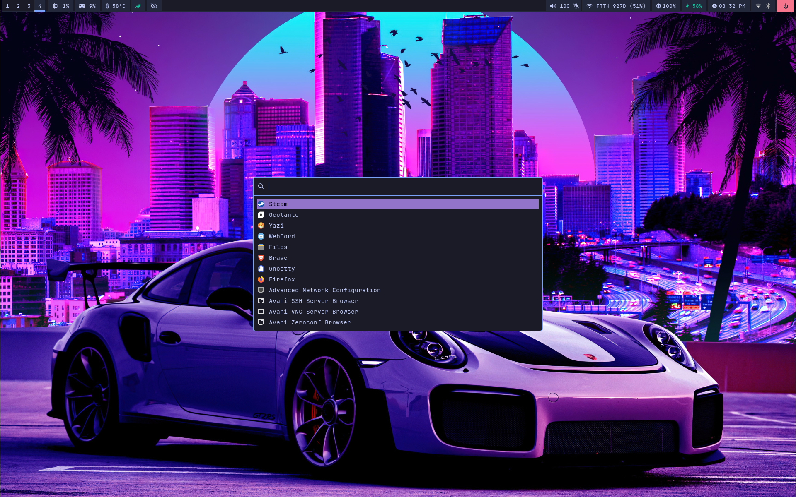
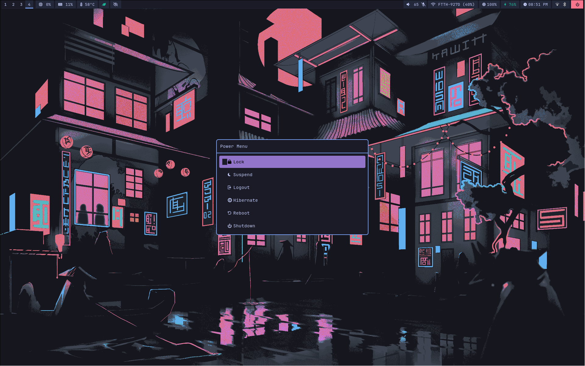
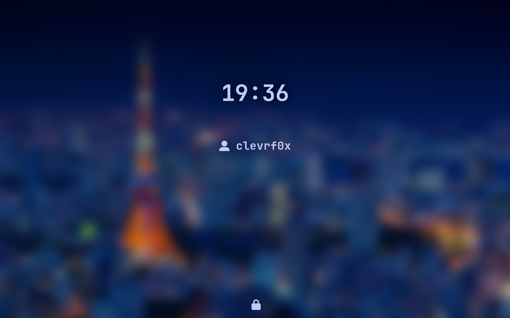

## Hyprland dots

### Gallery













### Usage

- Clone the dotfiles

  ```bash
  git clone https://github.com/clevrf0x/dotfiles
  ```

- Install GNU Stow

  ```bash
  sudo pacman -S stow
  ```

- Execute the command below (change username to your own username)

  ```bash
  # CAUTION: This will delete all existing dotfiles on target path if it exists

  stow . --target=/home/clevrf0x --adopt --ignore=assets
  git restore .
  ```

- Install the additional required packages like rofi, waybar, hyprland...etc
